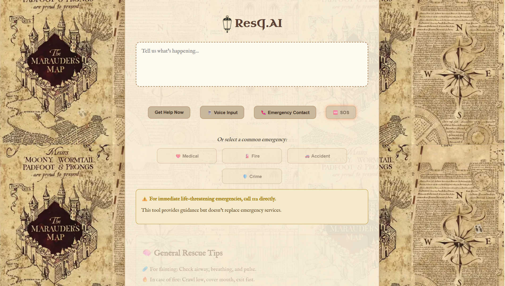
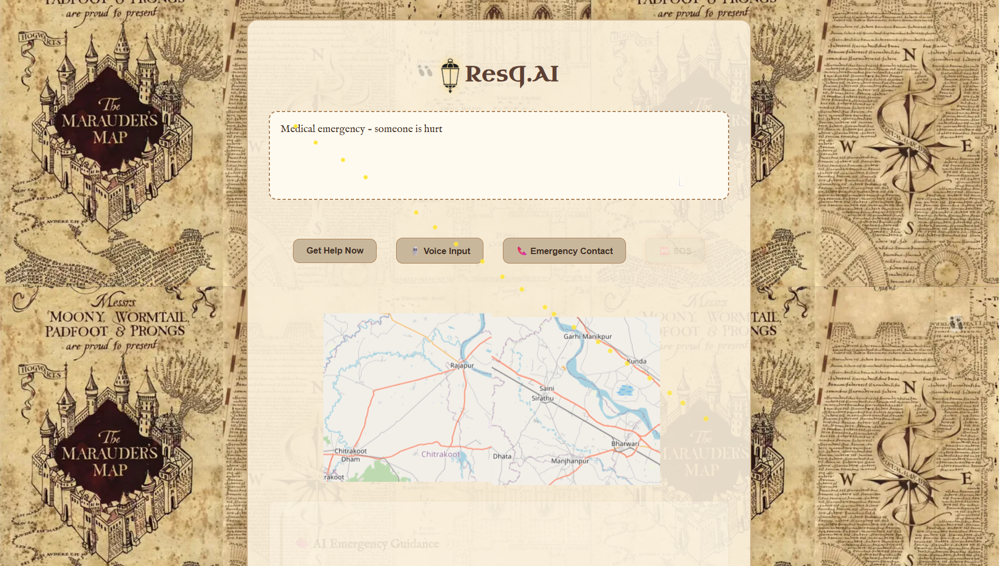
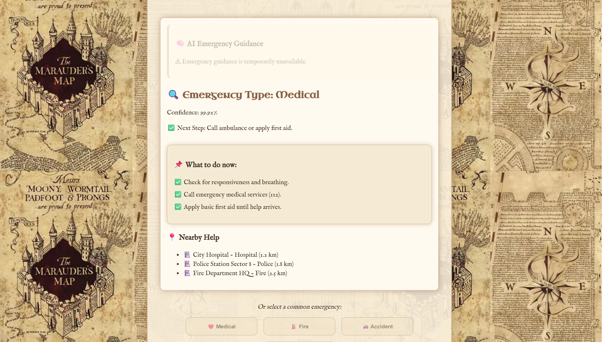

# 🧙‍♂️ ResQ.AI – The Marauder’s Emergency Assistant

> "I solemnly swear that I am up to no good… to help!"  
> *ResQ.AI is your magical first-responder assistant – intelligent, always alert, and ready to act across any realm.*

---

## 🌐 Overview

In the Muggle and wizarding worlds alike, emergencies can strike without warning. Whether you're stuck in the Forbidden Forest with no signal, or can't cast a Patronus to call for help – **ResQ.AI** is here. Powered by AI and wrapped in a Marauder’s Map–inspired design, it provides multilingual support, voice detection, emergency classification, and step-by-step help.

Built for both rural lands and remote realms – ResQ.AI brings **life-saving intelligence to your fingertips**. 🧠

---

## ✨ Key Features

| 🔮 Enchantment               | 📝 Description                                                                 |
|-----------------------------|---------------------------------------------------------------------------------|
| 🗣️ Voice & Text Input       | Speak or type – the AI will understand your cry for help                       |
| 🤖 Emergency Classification | Uses AI magic to identify the type of emergency (Medical, Fire, Crime...)      |
| 📍 Location Sharing         | Pinpoints your position like a Marauder’s Map                                  |
| 🆘 One-Tap SOS              | Trigger alerts instantly – even a Muggle could use it                          |
| 🧭 First Aid Guidance       | Contextual, step-by-step rescue tips                                           |
| 🛰️ Offline-Ready            | *Coming soon*                                           |
| 🔒 Emergency Contacts       | Auto-detect contacts and notify them *(Planned)*                               |
| 🧠 AI-Powered Guidance      | Dynamic response generation using Gemini/GPT *(Planned)*                       |
| 🗺️ Map Integration          | Visualize user’s position & movement *(Planned)*                               |

---

## 🧰 Tech Stack

| Layer         | Tools Used                                                                 |
|---------------|-----------------------------------------------------------------------------|
| 🧠 AI/ML       | HuggingFace Transformers (emergency classifier)                            |
| 🌐 Frontend    | React + Tailwind CSS, Web Speech API, PWA (offline-first design)           |
| 🗺️ Maps       | Leaflet or Mapbox (planned integration)                                     |
| 🔧 Backend     | Python + Flask, Transformers Pipeline, Flask-CORS                          |
| 🚀 Hosting     | Render.com / Vercel                                                        |
| 🔐 Security    | Emergency contact sync & alerting (planned)                                |

---

## 📸 Screenshots

### 🧭 Marauder’s Map–Inspired Design

> “Messrs. Moony, Wormtail, Padfoot, and Prongs are proud to present…”

#### 🏠 Homepage



#### 🧠 Working




---

## 🚀 Getting Started (Frontend)

### 🔧 Prerequisites

- Node.js (v18 or above)
- Backend running on Render or locally at `http://localhost:5000`

### 🧪 Setup Instructions

```bash
# Clone the repository
git clone https://github.com/Sajal-Srivastava/resqai-frontend.git
cd resqai-frontend

# Install dependencies
npm install

# Start the development server
npm run dev
